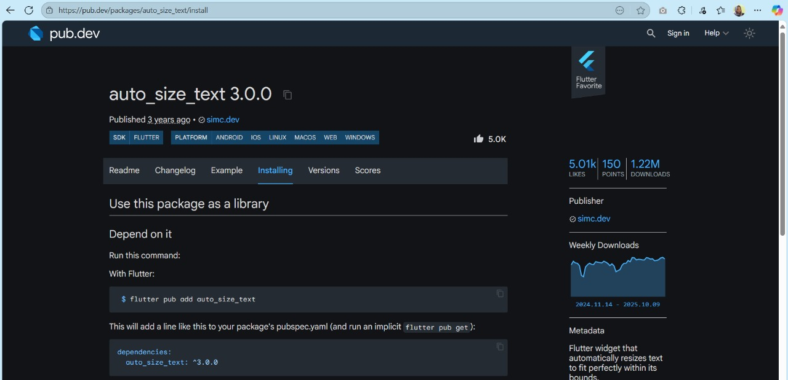
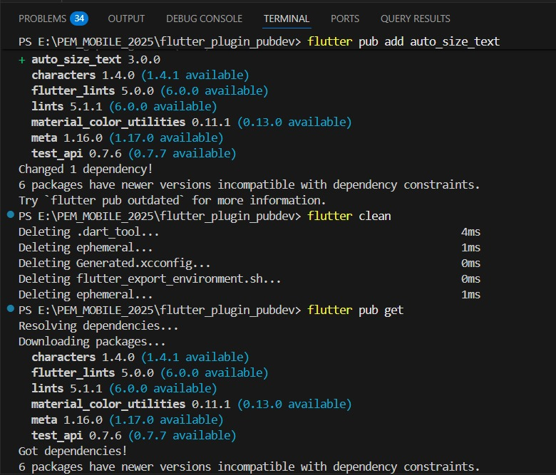
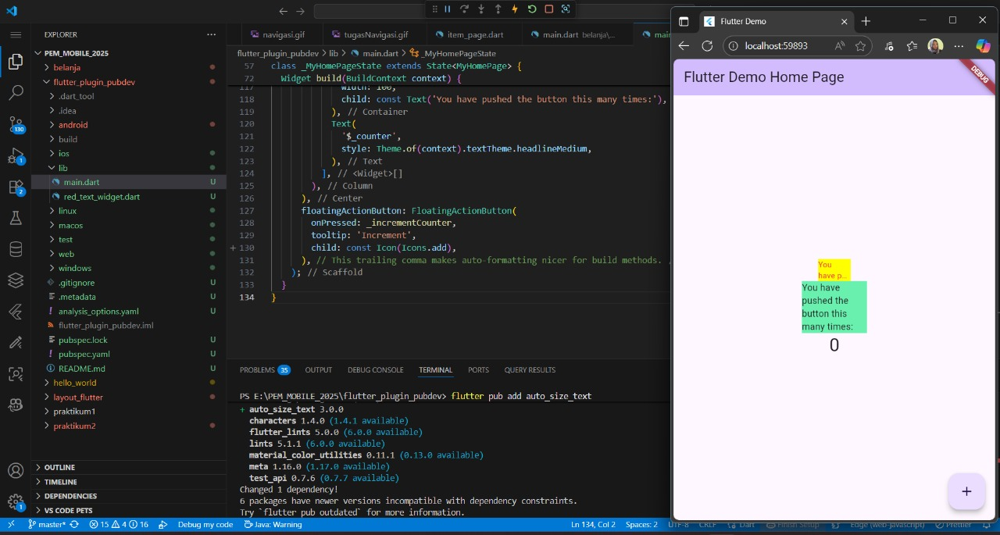

# flutter_plugin_pubdev

Installing Plugin

Add Plugin

Tampilan Hasil Add Widget

-- > Pada Praktikum ini telah berhasil menambahkan plugin pada project flutter. Plugin sendiri berfungsi sebagai code reuse, many eyes, low-level integration .

-- > Langkah 2 pada praktikum bertujuan untuk menambahkan plugin dalam proyek Flutter.

    - Plugin auto_size_text:

Plugin ini digunakan untuk mengatur ukuran teks secara otomatis agar bisa menyesuaikan dengan ruang yang tersedia.

    - Perintah flutter pub add auto_size_text:
Fungsinya adalah mengunduh dan menambahkan plugin auto_size_text ke proyek Flutter.

-- > Langkah 5 pada praktikum tersebut bertujuan untuk membuat widget kustom yang bisa menerima teks sebagai input.

    - final String text;
Dengan adanya variabel ini, widget menjadi dinamis, artinya teks yang ditampilkan bisa berbeda-beda sesuai nilai yang diberikan saat widget digunakan.

    - const RedTextWidget({Key? key, required this.text}) super(key: key);
Agar widget RedTextWidget bisa menampilkan teks berbeda-beda setiap kali digunakan.
Membuat widget lebih fleksibel dan reusable.

-- > Langkah 6 bertujuan untuk menambahkan dua widget Container yang masing-masing berisi teks, tapi ada perbedaan penting antara keduanya

    - Container(
        color: Colors.yellowAccent,
        width: 50,
        child: const RedTextWidget(
            text: 'You have pushed the button this many times:',
             ),
        ),

Memberikan warna latar (yellowAccent) dan lebar 50 pada area widget. Widget ini mendapat teks dari parameter text.

    - Container(
        color: Colors.greenAccent,
        width: 100,
        child: const Text(
       'You have pushed the button this many times:',
        ),
    ),
Memberikan warna latar (greenAccent) dan lebar 100. Widget ini tidak otomatis menyesuaikan ukuran teks.

1. key*
Mengontrol bagaimana widget satu menggantikan widget lain dalam widget tree Flutter.
Biasanya digunakan untuk menjaga state saat widget diganti.

2. textKey
Menentukan key khusus untuk widget Text yang dihasilkan oleh AutoSizeText.
Berguna untuk pengujian atau pengelolaan state internal Text.

3. style*
Jika tidak null, menentukan gaya teks, seperti ukuran,warna, fontWeight, dll.

4. minFontSize
Ukuran teks minimum saat plugin menyesuaikan teks agar muat di container.
Akan diabaikan jika presetFontSizes diatur.

5. maxFontSize
Ukuran teks maksimum saat menyesuaikan teks.
Akan diabaikan jika presetFontSizes diatur.

6. stepGranularity
Menentukan langkah perubahan ukuran font saat menyesuaikan dengan constraints.
Contohnya, stepGranularity: 1 berarti ukuran font menurun 1 pixel setiap langkah hingga muat.

7. presetFontSizes
Menentukan daftar ukuran font yang valid.
Harus dalam urutan menurun (besar → kecil).
Plugin hanya akan memilih ukuran dari daftar ini.

8. group
Menyinkronkan ukuran teks dari beberapa widget AutoSizeText sehingga memiliki ukuran yang sama.
Berguna untuk layout konsisten antar widget.

9. textAlign*
Menentukan perataan horizontal teks (misal TextAlign.left, TextAlign.center, TextAlign.right).

10. textDirection*
Menentukan arah teks (misal kiri ke kanan atau kanan ke kiri).
Memengaruhi interpretasi textAlign.

11. locale*
Digunakan untuk memilih font ketika karakter Unicode yang sama bisa dirender berbeda tergantung lokasi/language.

12. softWrap*
Menentukan apakah teks akan pindah baris di soft line breaks (line breaks normal).

13. wrapWords
Menentukan apakah kata yang tidak muat dalam satu baris akan dibungkus.
Default: true.

14. overflow*
Menentukan bagaimana teks yang meluber (overflow) ditangani.Contoh: memotong, ellipsis (…), atau clipping.

15. overflowReplacement
Widget yang ditampilkan jika teks tidak muat dan overflow terjadi.

16. textScaleFactor*
Mengatur skala teks, memengaruhi ukuran font logis (minFontSize, maxFontSize, presetFontSizes). Contohnya, textScaleFactor: 1.5 → teks membesar 50%.

17. maxLines-> Menentukan maksimal jumlah baris teks.
Jika teks lebih panjang, akan menyesuaikan ukuran font atau overflow terjadi.

18. semanticsLabel*
Memberikan label alternatif untuk accessibility (screen reader).Berguna agar teks tetap terbaca oleh pembaca layar.

