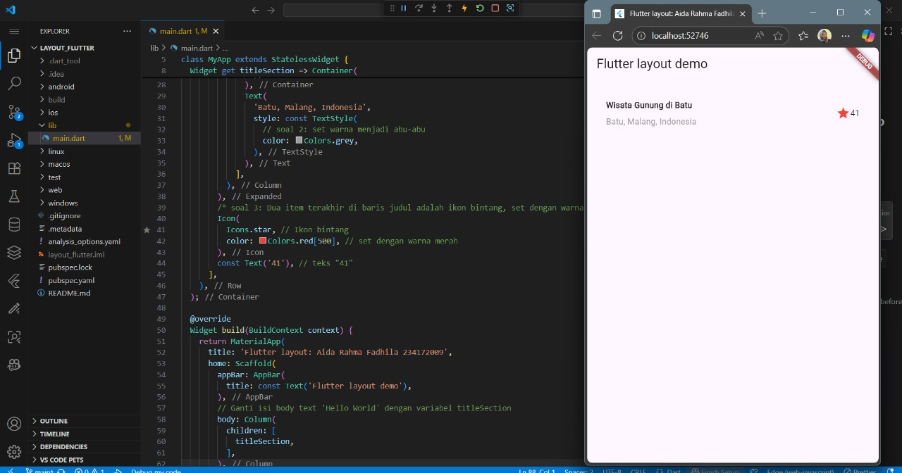

# layout_flutter

Praktikum 1 — Membangun Layout di Flutter

Pada praktikum ini membuat tata letak (layout) dan menata widget secara vertikal dan horizontal pada flutter.

Praktikum 2 - Implementasi Bagian Tombol (Button Section)

Pada praktikum ini, membuat button dan widget pada buttonSection, jadi yang ditampilkan adalah icon dan text button.

Praktikum 3: Implementasi Bagian Teks (Text Section)

Pada praktikum ini, menambahkan text dengan dilengkapi padding.

 Praktikum 4: Implementasi Bagian Gambar (Image Section)
 
Pada praktikum ini, menambahkan assets berupa image pada flutter.