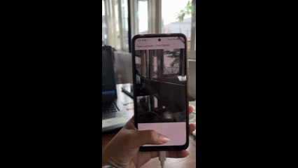

# photo_filter_carousel
Filter Carousel adalah komponen antarmuka pada aplikasi mobile yang digunakan untuk menampilkan sekumpulan opsi filter dalam bentuk deretan kartu atau tombol yang dapat digeser secara horizontal (horizontal scroll).

 
